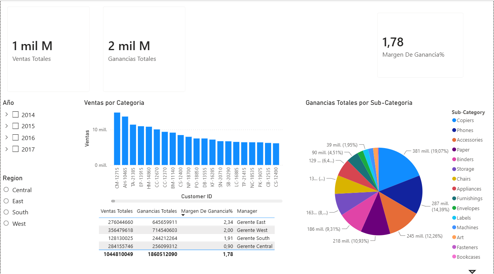

# Power BI: Dashboard de Inteligencia de Negocios y Modelado de Datos Avanzado

Este repositorio contiene un proyecto práctico de Business Intelligence desarrollado en **Power BI**, enfocado en la ingesta, transformación, modelado dimensional y análisis visual de datos corporativos. El proyecto demuestra la capacidad para estructurar soluciones analíticas interactivas que faciliten la toma de decisiones mediante el uso de filtros cruzados, jerarquías de datos y el desarrollo de métricas calculadas personalizadas.

---

## 📊 Interfaz del Dashboard en Power BI

Para que tu diseño visual se aprecie de forma inmediata al ingresar a tu repositorio, guarda una captura de pantalla de tu panel en la raíz con el nombre exacto de `visualizacion_pbi.png`:



---

## 🛠️ Arquitectura de Ingeniería del Proyecto

El desarrollo del reporte se dividió en tres fases técnicas esenciales:

### 1. Extracción y Transformación de Datos (ETL en Power Query)
* Ingesta de fuentes de datos heterogéneas y limpieza de registros estructurados.
* Normalización de tipos de datos, eliminación de duplicados, filtrado de valores nulos y dinamización de columnas mediante lenguaje **M**.

### 2. Modelado de Datos y Relaciones (Model View)
* Diseño de un esquema de datos eficiente (como el modelo de estrella o copo de nieve) para garantizar la integridad referencial y optimizar el rendimiento del motor de base de datos *VertiPaq*.
* Configuración de la direccionalidad de los filtros cruzados y organización de tablas de hechos frente a tablas de dimensiones.

### 3. Desarrollo de Inteligencia de Tiempo y Métricas (Código DAX)
El núcleo analítico implementa expresiones en lenguaje **DAX (Data Analysis Expressions)** para calcular indicadores clave de rendimiento (KPIs). Puedes encontrar el listado de fórmulas en la carpeta `src/dax_measures.txt`.

* **Ejemplo de Medida Calculada de Acumulación Anual (YTD):**
```dax
Ventas_YTD = TOTALYTD(SUM(Ventas[Monto]), 'Calendario'[Fecha])

```

* **Ejemplo de Medida para Comparación Temporal (Año Anterior):**

```dax
Ventas_Año_Anterior = CALCULATE(SUM(Ventas[Monto]), SAMEPERIODLASTYEAR('Calendario'[Fecha]))

```

---

## ⚡ Conceptos Técnicos Aplicados

* **Cómputo en Contextos de Filtro y Fila**: Comprensión profunda de cómo operan las funciones de iteración y cálculo (`CALCULATE`, `SUMX`) bajo los filtros activos de la interfaz de usuario.
* **Diseño Orientado a la Experiencia de Usuario (UX/UI)**: Distribución armónica de componentes visuales (gráficos de tarjetas, barras acumuladas, matrices analíticas) y uso estratégico de segmentadores (*Slicers*) para habilitar una navegación intuitiva y ejecutiva.
